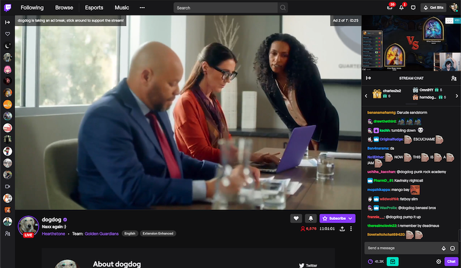
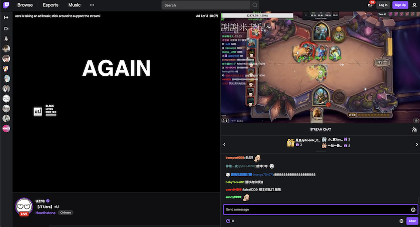

# TwitchPBPExpander
Expand and unmute the picture by picture video player for Twitch

Never missing out any exciting moment of your favorite streamer!

# Features
 * Expands the PBP video
 * Unmutes the PBP video
 
  
 <h4 align="center">
  Orginal Layout / Expanded Layout
 </h4>
 <h1 align="center">
  
  
  
   
</h1>

# Notice
**This extension only works for the mode that Twitch provides PBP video**
 * Twitch does not provide PBP when side chat bar is not allow.
 * Twitch does not provide PBP for those channel not under Gaming category.

What is PBP video?
See: https://help.twitch.tv/s/article/picture-by-picture-ads?language=en_US

# How to use
1. Download the whole TwitchPBPExpander directory
2. Go to chrome://extensions/ and enable Developer Mode
3. Click on 'Load unpacked' and go to the directory with the extension (see if manifest.json is in the directory)

